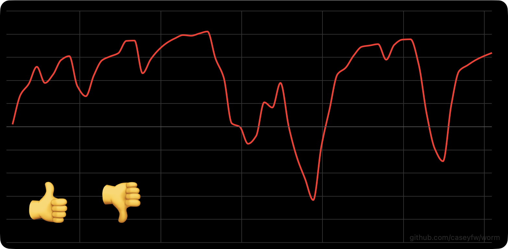

# The Worm 📈

A real-time audience reaction indicator, inspired by Roy Morgan's "The Reactor", commonly called [The Worm](https://en.wikipedia.org/wiki/Worm_(marketing)). Audience members tap 👍 or 👎; the server aggregates reactions and broadcasts a score between `-1` and `+1` once per second. Connected browsers render the resulting "worm" snaking across a full-window dark-mode graph.



## Quick start

```bash
npm install
npm run build
npm run dev -w @worm/server
```

Open [http://localhost:3000](http://localhost:3000) in your browser.

For development with hot-reload on the frontend, run both in separate terminals:

```bash
npm run dev -w @worm/server    # backend on :3000
npm run dev -w @worm/web       # frontend on :5173 (proxies socket to :3000)
```

## Docker

```bash
docker build -t worm .
docker run --rm -p 3000:3000 worm
```

## Configuration

Environment variables (set when starting the server):

| Variable   | Default  | Description |
| ---------- | -------- | ----------- |
| `PORT`     | `3000`   | HTTP server port |
| `STRATEGY` | `ewma`   | Aggregation strategy (see below) |

### Aggregation strategies

| Strategy   | Behaviour |
| ---------- | --------- |
| `ewma`     | Exponentially weighted moving average. Each reaction nudges the value toward ±1; silence decays smoothly back to 0. No cliff-edge drops. |
| `mean`     | Arithmetic mean of all reactions in a rolling 10-second window. Simple and literal, but values jump when events age out of the window. |
| `momentum` | Physics-inspired. Reactions add impulse (velocity); friction and drag pull the value back toward 0. Needs sustained input to stay high. Feels organic. |

Example:

```bash
STRATEGY=mean npm run dev -w @worm/server
```

## Architecture

- **Backend** — Node.js + TypeScript, Express + Socket.IO. In-memory aggregator; no database.
- **Frontend** — TypeScript + Vite, [uPlot](https://github.com/leeoniya/uPlot) for the graph, `socket.io-client` for the live connection.
- **Shared** — `packages/shared` exports event names and payload types used by both server and web.

```
packages/
  shared/   # event contracts (types + constants)
  server/   # Express + Socket.IO + aggregator
  web/      # Vite app (dark theme, uPlot graph, emoji buttons)
```

## How it works

1. Clients connect via Socket.IO and receive a `history` event containing the last 60 samples.
2. Every second the server calls `tick()` on the aggregator, producing a new `sample { t, value }` broadcast to all clients.
3. Clicking 👍 or 👎 emits a `reaction` event to the server, which feeds it into the aggregator.
4. The frontend renders samples as a smooth spline on a fixed `[-1, +1]` y-axis with a 60-second scrolling x window.

## Scripts

| Command | Description |
| ------- | ----------- |
| `npm run build` | Build all workspaces (shared → server + web) |
| `npm test` | Run Vitest tests |
| `npm run lint` | ESLint across all packages |
| `npm run dev -w @worm/server` | Start server in watch mode (tsx) |
| `npm run dev -w @worm/web` | Start Vite dev server with HMR |

## License

MIT
